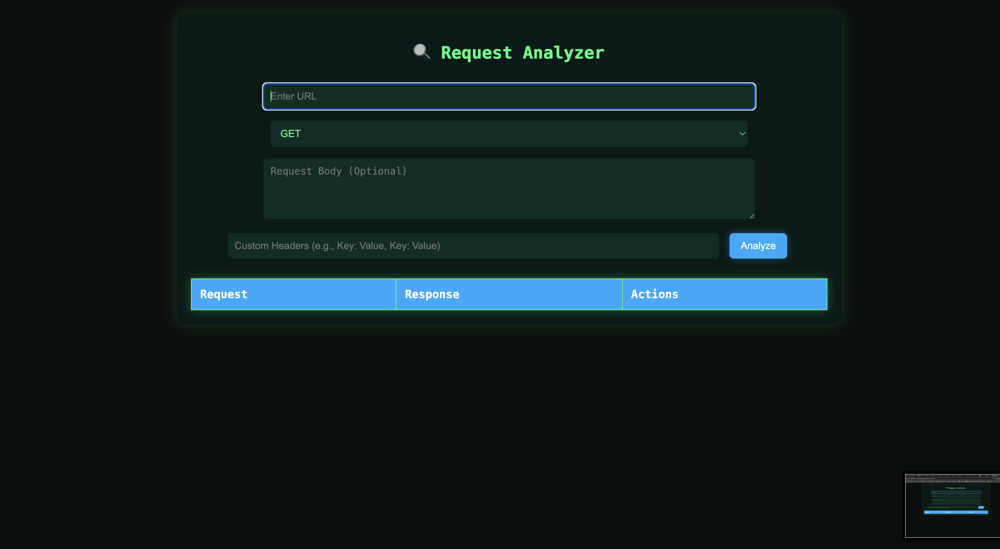

# 🚀 Request Analyzer - Hacker Style  

### 🔗 Live Demo: [Request Analyzer](https://be-like-akay.github.io/request-analyzer/)  

## 📌 Overview  
**Request Analyzer** is a powerful web-based tool designed to analyze HTTP requests and responses. It provides detailed insights, including response headers, latency, security headers, and more, all in a **hacker-style neon UI**.  

## 🎨 Features  
- ✅ **Analyze HTTP Requests & Responses**  
- ✅ **View Security Headers**  
- ✅ **View Full Response in a New Tab (JSON Format)**  
- ✅ **Expand/Collapse Large Responses**  
- ✅ **Custom Headers & Request Body Support (Optional)**  
- ✅ **Futuristic Hacker UI (Black, Green & Aqua Theme)**  

## 🖼️ Screenshots  
  

## 📂 Installation  
To run this project locally, follow these steps:  

1. **Clone the repository:**  
   ```bash
   git clone https://github.com/be-like-akay/request-analyzer.git
   cd request-analyzer

Open index.html in a browser.
That's it! 🎉 No server setup required.

🛠️ How to Use
Enter the URL you want to analyze.
(Optional) Add custom headers in JSON format.
(Optional) Enter a request body if making a POST request.
Click Analyze to send the request.
View the detailed response, security headers, and latency.
Click "View Full" for a JSON-formatted response in a new tab.
Click "Copy cURL" to copy the equivalent cURL command.
👨‍💻 Contributing
Feel free to contribute by submitting issues or pull requests.
Fork the repo, make your changes, and submit a PR.

📜 License
This project is licensed under the MIT License.

